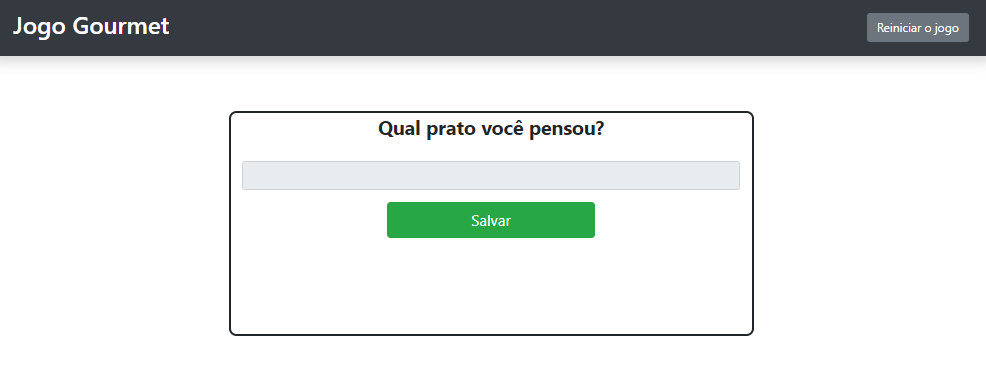

<p align="center">
  <a href="#-projeto">Projeto</a>&nbsp;&nbsp;&nbsp;|&nbsp;&nbsp;&nbsp; 
  <a href="#-como-rodar">Como rodar</a>&nbsp;&nbsp;&nbsp;|&nbsp;&nbsp;&nbsp;
  <a href="#-como-contribuir">Como contribuir</a>&nbsp;&nbsp;&nbsp;
 </p>

<br>

# Jogo Goumert

## 🚀 Tecnologias

Esse projeto foi desenvolvido com as seguintes tecnologias:

- [PHP](https://www.php.net/) - 7.2
- [Composer](https://getcomposer.org/) - v1.8.4
- [Postgres](https://www.postgresql.org/) - 10.15-alpine
- [CSS3](https://developer.mozilla.org/pt-BR/docs/Web/CSS)
- [HTML5](https://developer.mozilla.org/pt-BR/docs/Web/HTML/HTML5)
- [JavaScript](https://developer.mozilla.org/pt-BR/docs/Web/JavaScript)
- [Docker](https://www.docker.com/) - 19.03.8
- [Apache](https://www.apache.org/) 2.4.35

## 💻 Projeto

O projeto é um jogo onde a inteligência da máquina tenta adivinhar o prato que você está pensando.

- Página inicial.
<p align="center">
  
</p>

- Primeira pergunta.
<p align="center">
  
</p>

- Usuário ganhou.
<p align="center">
  
</p>

- Usuário ganhou.
<p align="center">
  
</p>

- Escrevendo característica.
<p align="center">
  
</p>

- '404'.
<p align="center">
  
</p>

## 🚀 Como Rodar

- Clone o projeto.
- Entre na pasta do projeto e rode "composer install".
- Rodar o Postgres com docker: 
```
docker run --name postgres -e POSTGRES_PASSWORD=docker -p 5432:5432 -d postgres
```
- Criar um banco com o nome game_gourmet.
- Executer o comando "php artisan migrate:fresh".
- Executer o comando "php artisan db:seed".
- Execute o comando "composer server".
- Acesse http://localhost:8000/

## Licença

O framework Laravel e esse projeto usam a linceça [MIT license](https://opensource.org/licenses/MIT).
